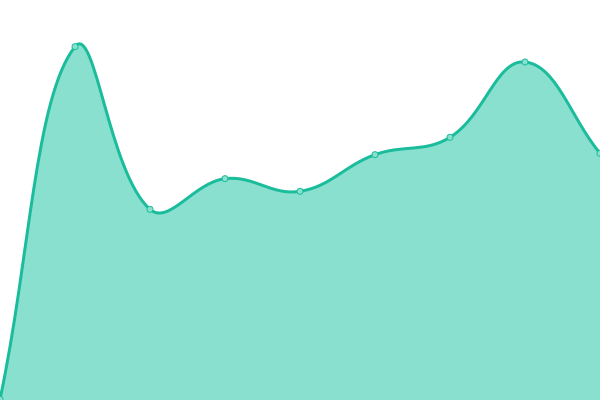

# [📈 Live Status](https://ConalMullan.github.io/ds-embedded-test): <!--live status--> **🟧 Partial outage**

This repository contains the open-source uptime monitor and status page for [ConalMullan](https://ConalMullan.github.io/ds-embedded-test), powered by [Upptime](https://github.com/upptime/upptime).

With [Upptime](https://upptime.js.org), you can get your own unlimited and free uptime monitor and status page, powered entirely by a GitHub repository. We use [Issues](https://github.com/ConalMullan/ds-embedded-test/issues) as incident reports, [Actions](https://github.com/ConalMullan/ds-embedded-test/actions) as uptime monitors, and [Pages](https://ConalMullan.github.io/ds-embedded-test) for the status page.

<!--start: status pages-->
<!-- This summary is generated by Upptime (https://github.com/upptime/upptime) -->
<!-- Do not edit this manually, your changes will be overwritten -->
<!-- prettier-ignore -->
| URL | Status | History | Response Time | Uptime |
| --- | ------ | ------- | ------------- | ------ |
|  [Embedded](https://dashboard.digitalsamba.com) | 🟩 Up | [embedded.yml](https://github.com/ConalMullan/ds-embedded-test/commits/HEAD/history/embedded.yml) | 

 382ms
     
 | 

<a href="https://ConalMullan.github.io/ds-embedded-test/history/embedded">100.00%</a>
    

|  [Media server 1](https://mediastream1.prod.monza-eu.wbcnf.net/mediaserver1/info) | 🟩 Up | [media-server-1.yml](https://github.com/ConalMullan/ds-embedded-test/commits/HEAD/history/media-server-1.yml) | 

 405ms
     
 | 

<a href="https://ConalMullan.github.io/ds-embedded-test/history/media-server-1">100.00%</a>
    

|  [Media server 2](https://mediastream2.prod.monza-eu.wbcnf.net/mediaserver1/info) | 🟩 Up | [media-server-2.yml](https://github.com/ConalMullan/ds-embedded-test/commits/HEAD/history/media-server-2.yml) | 

 387ms
     
 | 

<a href="https://ConalMullan.github.io/ds-embedded-test/history/media-server-2">100.00%</a>
    

|  [Signalling](wss://datastream1.digitalsamba.com/ws) | 🟥 Down | [signalling.yml](https://github.com/ConalMullan/ds-embedded-test/commits/HEAD/history/signalling.yml) | 

 0ms
     
 | 

<a href="https://ConalMullan.github.io/ds-embedded-test/history/signalling">0.00%</a>
    

<!--end: status pages-->

[**Visit our status website →**](https://ConalMullan.github.io/ds-embedded-test)

## 📄 License

- Powered by: [Upptime](https://github.com/upptime/upptime)
- Code: [MIT](./LICENSE) © [Anand Chowdhary](https://anandchowdhary.com), supported by [Pabio](https://pabio.com)
- Data in the `./history` directory: [Open Database License](https://opendatacommons.org/licenses/odbl/1-0/)
